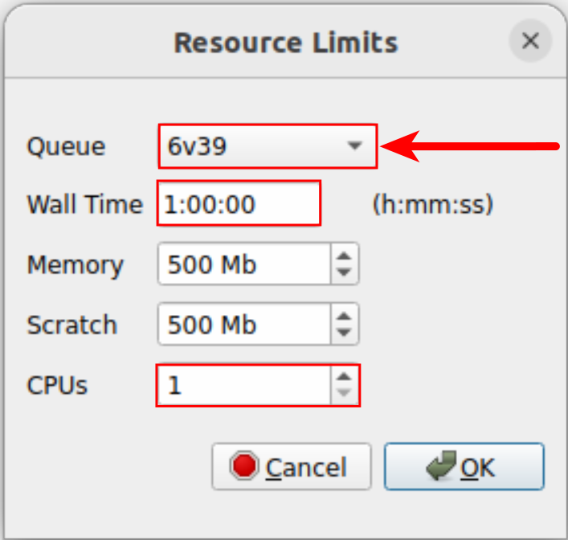

# IQmol Setup Guide

**Author:** Markus G. S. Weiss  
**Date:** 2024/10/28

---

## Table of Contents

1. [Introduction](#introduction)
2. [Configuring IQmol](#configuring-iqmol)
   - [Setting Up the Server Details](#setting-up-the-server-details)
3. [Submitting a Job in IQmol](#submitting-a-job-in-iqmol)
4. [Conclusion](#conclusion)

---

## Introduction

This guide will walk you through configuring IQmol to connect to the cluster and submit jobs. If you plan to use SSH key authentication, ensure that you have already generated SSH keys and uploaded your public key to the server. If you prefer to use password authentication, you can proceed without setting up SSH keys.

## Configuring IQmol

Follow the steps below to set up the server details in IQmol.

### Setting Up the Server Details

1. **Open IQmol.**

2. **Navigate to Calculation → Edit Servers.**

     
   *Figure 1: Accessing Edit Servers in IQmol*

3. **Click on the "+" button to create a new server configuration.**

     
   *Figure 2: Add New Server in IQmol*

   The server configuration window will appear with numbered fields as shown below. Follow the instructions corresponding to each number:

     
   *Figure 3: Server Configuration Window*

   **Instructions:**

   **1. Connection:** Select **SSH** as the connection method.

   **2. Name:** Enter a recognizable server name, such as `ganymede2`.

   **3. Host Address:** Enter

     ```
     ganymede2.circ.utdallas.edu
     ```

   **4. Authentication:** Choose the appropriate method:

   - If you set up SSH keys, select **Public Key**.
   - If using an SSH agent, select **Agent**.
   - If you prefer to use a password, select **Password**.

   **5. Username:** Enter your **NetID**.

   **6. Working Directory:** Set to `/home/your_netid`, replacing `your_netid` with your actual NetID.

   **7. Queue System:** Select **Slurm** from the dropdown menu.

   **8. Configure Queue System:**

   - Click on **Configure Queue System**. A new window will appear.

       
     *Figure 4: Queue System Configuration*

   - In the **Setup Commands** section, delete any existing lines and add the following lines:

     ```
     #!/bin/bash
     #SBATCH --partition=${QUEUE}
     #SBATCH --time=${WALLTIME}
     #SBATCH --nodes=1
     #SBATCH --cpus-per-task=${NCPUS}
     #SBATCH --mem-per-cpu=4000
     #SBATCH --output=${JOB_NAME}.err
     #SBATCH --error=${JOB_NAME}.err

     module purge
     module load qchem/6.2.1

     qchem -nt ${NCPUS} ${JOB_NAME}.inp ${JOB_NAME}.out
     ```

   - Click **OK** to save the queue system configuration.

   **9. Configure SSH:**

   - Click on **Configure SSH**. A new window will appear.

   - **For the Known Hosts File:**

     - Ensure that the `~/.ssh` directory exists.

     - **Windows Users:**

       - If the directory does not exist, create it at `%USERPROFILE%\.ssh`.

     - **macOS/Linux Users:**

       - The directory should exist at `~/.ssh`.

   - **The Known Hosts File path:**

     - **For Linux:**

       ```
       /home/your_local_username/.ssh/known_hosts
       ```

     - **For macOS:**

       ```
       /Users/your_local_username/.ssh/known_hosts
       ```

     - **For Windows:**

       ```
       C:\Users\your_local_username\.ssh\known_hosts
       ```

   - **Authentication Method:**

     - **Password Authentication:**

       - Leave the **Private Key File** and **Public Key File** fields empty.

     - **Public Key Authentication:**

       - Set the **Private Key File** to your private key, e.g.,

         - For Linux:

           ```
           /home/your_local_username/.ssh/id_ed25519
           ```

         - For macOS:

           ```
           /Users/your_local_username/.ssh/id_ed25519
           ```

         - For Windows:

           ```
           C:\Users\your_local_username\.ssh\id_ed25519
           ```

       - Set the **Public Key File** to your public key, e.g.,

         - For Linux:

           ```
           /home/your_local_username/.ssh/id_ed25519.pub
           ```

         - For macOS:

           ```
           /Users/your_local_username/.ssh/id_ed25519.pub
           ```

         - For Windows:

           ```
           C:\Users\your_local_username\.ssh\id_ed25519.pub
           ```

     - **Agent Authentication:**

       - Ensure your SSH agent is running and has your key added.
       - Leave the **Private Key File** and **Public Key File** fields empty.

   - Click **OK** to save the SSH configuration.

       
     *Figure 5: SSH Configuration*

4. **Click OK to save the server settings.** You may use the arrow keys in Figure 2 to move your created server up as the default.

## Submitting a Job in IQmol

1. **Prepare your calculation in IQmol as usual.**

2. **When ready to submit, navigate to Calculation → Q-Chem Setup.**

3. **Select your created server (`ganymede2`) from the list.**

     
   *Figure 6: Submitting a Job in IQmol*

4. **The following steps may need to be done if prompted:**

   - Upon submission, a prompt may appear to add the Host to the known hosts file. Click **YES**.
   - If using password authentication, enter your **NetID password** when prompted.

5. **Choose a Folder Name for your job files.** **Note:** Do not use spaces in the folder name.

6. **Configure the job settings:**

   - **Queue:**

     - If you are enrolled, select the `6v39` partition.

   - **Wall Time:** Set the maximum time for your job. Ensure that you allocate enough time, but do not exceed 48 hours.

   - **CPUs:** Select the number of CPUs you wish to use. Do not exceed 16 CPUs per job.


       
     *Figure 7: Configuring Job Resources*

7. **Click OK to submit the job.**

## Conclusion

You have successfully configured IQmol to connect to the server and submitted a job.
Remember to monitor your jobs on the server. If you encounter any issues, contact your system administrator for assistance.

