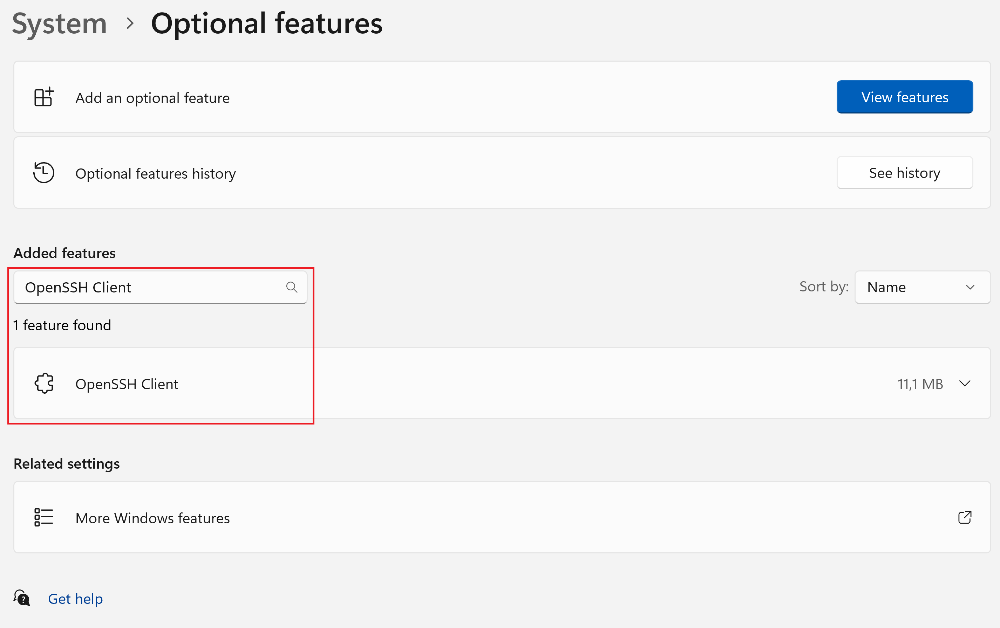
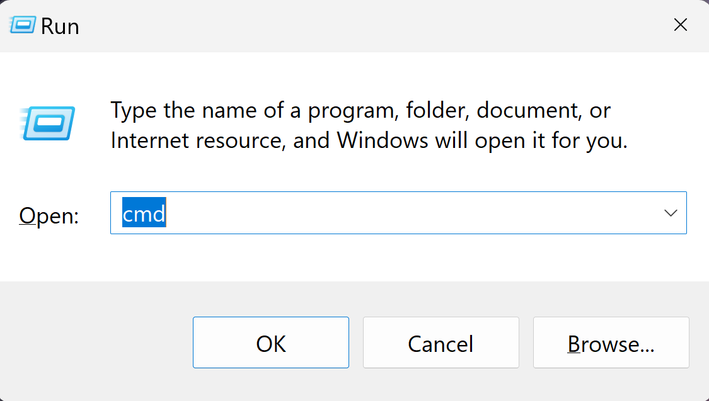
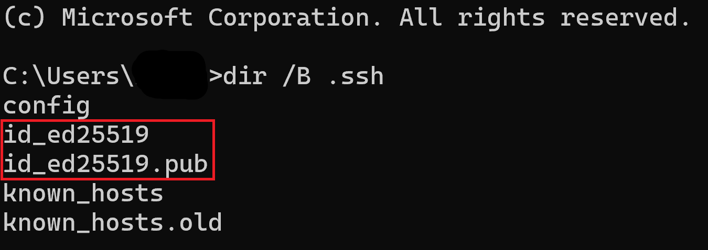
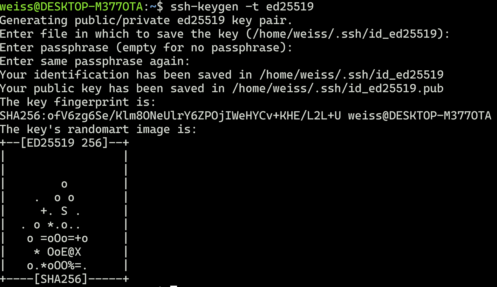
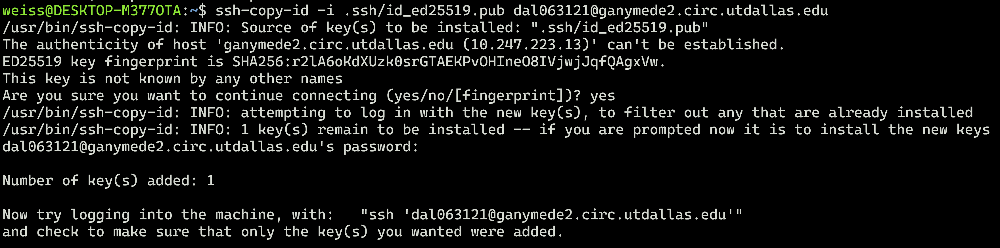
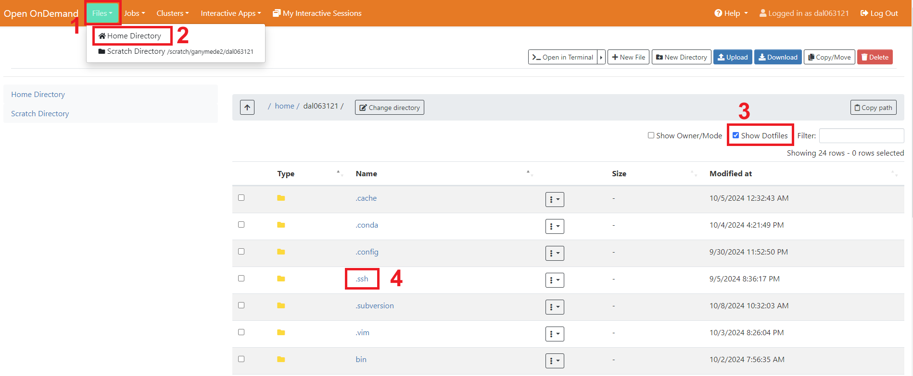
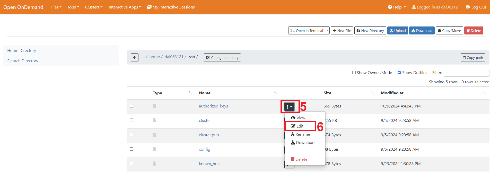

# SSH Key Generation, Adding to SSH Agent, and Uploading to the Cluster

**Author:** Markus G. S. Weiss  
**Date:** 2024/10/28

---

## Table of Contents

1. [Introduction](#introduction)
2. [Generating SSH Keys](#generating-ssh-keys)
   - [Installing OpenSSH Client (Windows Only)](#installing-openssh-client-windows-only)
   - [Opening the Terminal](#opening-the-terminal)
   - [Checking for Existing SSH Keys](#checking-for-existing-ssh-keys)
   - [Generating the SSH Key](#generating-the-ssh-key)
3. [Adding the SSH Key to the SSH Agent](#adding-the-ssh-key-to-the-ssh-agent)
   - [macOS and Linux](#macos-and-linux)
   - [Windows (Using OpenSSH Agent)](#windows-using-openssh-agent)
4. [Copying the Public Key to the Server](#copying-the-public-key-to-the-server)
   - [For macOS/Linux Users: Using ssh-copy-id](#for-macoslinux-users-using-ssh-copy-id)
   - [For Windows Users: Command-Line Method](#for-windows-users-command-line-method)
   - [Alternative Method for Windows and Other Systems: Manual Copy via Browser](#alternative-method-for-windows-and-other-systems-manual-copy-via-browser)
5. [Conclusion](#conclusion)

---

## Introduction

This guide will walk you through generating SSH keys, adding your private key to an SSH agent, and uploading your public key to the cluster for secure authentication. Instructions are provided for both Windows and macOS/Linux users.

## Generating SSH Keys

SSH keys are used for secure authentication between your local machine and the server. Follow the steps below based on your operating system.

### Installing OpenSSH Client (Windows Only)

1. **Ensure that the OpenSSH Client is enabled on your Windows 11 machine.**

   - Open **Settings** and search for **Optional features** or navigate to **System → Optional features** for Windows 11 or **Apps → Apps and Features → Manage Optional Features** for other versions.
   - Search for **OpenSSH Client**. If not found, proceed with the next steps.
   - Click on **Add a feature**.
   - Search for **OpenSSH Client** and install it.

     
   *Figure 1: Enabling the OpenSSH Client in Windows Settings*

### Opening the Terminal

1. **Open the appropriate terminal for your operating system:**

   - **Windows Users:** Open **Command Prompt** (Press **Windows key + R**, type `cmd`, and click **OK**).
   - **macOS/Linux Users:** Open **Terminal** (macOS: Press **Command + Space**, type `Terminal`, and press **Enter**; Linux: Press **Ctrl + Alt + T** or search for `Terminal`).

     
   *Figure 2: Opening Command Prompt*

### Checking for Existing SSH Keys

Before generating a new SSH key, check if you already have one.

2. **List the contents of the `~/.ssh` directory:**

   - **Windows:**

     ```
     dir %USERPROFILE%\.ssh
     ```

   - **macOS/Linux:**

     ```
     ls ~/.ssh
     ```

3. **Check for existing SSH key files.**

   - If you see files like `id_ed25519` and `id_ed25519.pub`, you already have an SSH key pair. You can use these existing keys or generate a new pair if necessary.

       
     *Figure 3: Existing SSH Keys in `~/.ssh` Directory*

### Generating the SSH Key

4. **Generate an ED25519 SSH key by typing the following command:**

   ```
   ssh-keygen -t ed25519
   ```

5. **Follow the prompts:**

   - When prompted for a file in which to save the key, press **Enter** to accept the default location or specify a custom path.
   - If prompted to overwrite an existing key, choose to proceed or specify a different filename.
   - When prompted for a passphrase, you can press **Enter** to leave it empty or enter a secure passphrase (recommended if using an SSH agent).

       
     *Figure 4: Generating SSH Key*

## Adding the SSH Key to the SSH Agent

An SSH agent holds your private keys in memory, allowing you to use them without re-entering your passphrase every time. Follow the instructions for your operating system.

### macOS and Linux

1. **Start the SSH agent:**

   ```
   ssh-agent
   ```

2. **Add your private key to the SSH agent:**

   ```
   ssh-add ~/.ssh/id_ed25519
   ```

3. **If prompted, enter your passphrase.**

4. **Verify that your key has been added:**

   ```
   ssh-add -l
   ```

5. **You should see a list of your added SSH keys.**

### Windows (Using OpenSSH Agent)

1. **Ensure the SSH agent service is running and set to start automatically. Run the following command in PowerShell as Administrator:**

   ```
   Get-Service ssh-agent | Set-Service -StartupType Automatic -PassThru | Start-Service
   ```

2. **Add your private key to the SSH agent:**

   ```
   ssh-add %USERPROFILE%\.ssh\id_ed25519
   ```

3. **If prompted, enter your passphrase.**

4. **Verify that your key has been added:**

   ```
   ssh-add -l
   ```

5. **You should see a list of your added SSH keys.**

**Note:** If you're using PuTTY's Pageant as your SSH agent:

1. **Open Pageant.**

2. **Click on Add Key.**

3. **Navigate to your private key file.** If your key is in OpenSSH format, you may need to convert it using PuTTYgen.

4. **Enter your passphrase if prompted.**

5. **The key is now loaded into Pageant.**

## Copying the Public Key to the Server

Depending on your operating system, follow the appropriate method to copy the public key to the server:

### For macOS/Linux Users: Using ssh-copy-id

1. **Use the `ssh-copy-id` command to copy your public key to the server. Replace `your_netid` with your actual NetID:**

   ```
   ssh-copy-id your_netid@ganymede2.circ.utdallas.edu
   ```

2. **When prompted, type `yes` to continue connecting and press **Enter**.**

3. **Enter your NetID password when prompted.**

4. **This command appends your public key to the `authorized_keys` file on the server automatically.**

     
   *Figure 5: Using ssh-copy-id to Copy Public Key*

### For Windows Users: Command-Line Method

1. **Open Command Prompt.**

2. **Use the following command to copy your public key to the server. Replace `your_netid` with your actual NetID:**

   ```
   type %USERPROFILE%\.ssh\id_ed25519.pub | ssh your_netid@ganymede2.circ.utdallas.edu "cat >> /home/your_netid/.ssh/authorized_keys"
   ```

3. **When prompted, enter your NetID password.**

4. **This command appends your public key to the `authorized_keys` file on the server automatically.**

### Alternative Method for Windows and Other Systems: Manual Copy via Browser

If the command-line method doesn't work, you can manually copy your public key to the server:

1. **Locate your public key file, typically found at `~/.ssh/id_ed25519.pub`.**

2. **Open the file (`id_ed25519.pub`) and copy the entire contents.** **Never share your private key!**

3. **Open a web browser and navigate to [https://g2-ood.circ.utdallas.edu](https://g2-ood.circ.utdallas.edu).**

4. **Log in with your credentials.**

5. **Click on Files and Home Directory, then check the Show dot files box.**

6. **Navigate to your `~/.ssh` directory.** (If it doesn't exist, create it.)

7. **Open the `authorized_keys` file** (or create it if it doesn't exist).

8. **Paste your public key on a new line in the file and save it.**

     
     
   *Figure 6: Pasting Public Key into `authorized_keys`*

## Conclusion

You have successfully generated an SSH key pair, added your private key to the SSH agent, and uploaded your public key to the cluster. This will enable secure, password-less authentication when connecting to the server.

